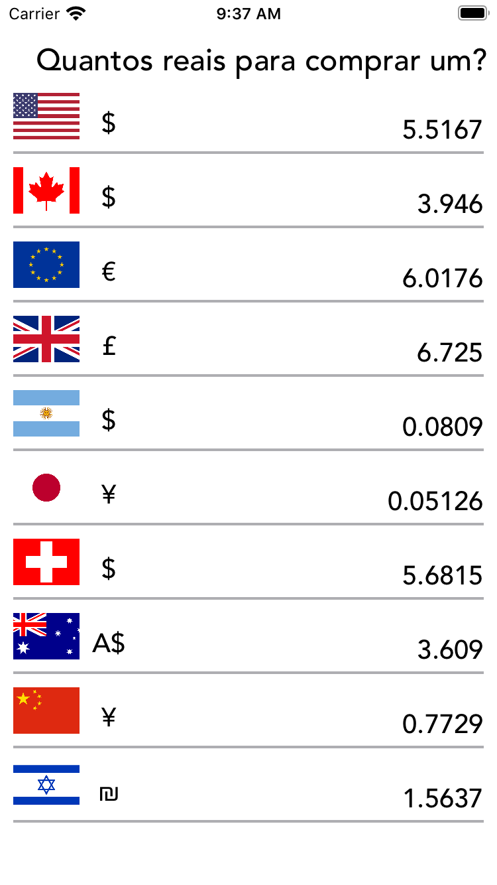

# quantos-reais
É um App de consulta do valor do real perante as principais moedas do mundo.

É um App que tem como objetivo para consultar o valor em reais para comprar uma unidade das principais moedas do mundo.

* USD-BRL (Dólar Comercial)
* USDT-BRL (Dólar Turismo)
* CAD-BRL (Dólar Canadense)
* AUD-BRL (Dólar Australiano)
* EUR-BRL (Euro)
* GBP-BRL (Libra Esterlina)
* ARS-BRL (Peso Argentino)
* JPY-BRL (Iene Japonês)
* CHF-BRL (Franco Suíço)
* CNY-BRL (Yuan Chinês)
* YLS-BRL (Novo Shekel Israelense)

---
<h2 align="center">

</h2>

## 🔖 API
https://docs.awesomeapi.com.br/api-de-moedas

## 📌 Support

- Twitter at [@fbw_] (https://twitter.com/fbw_)
- Instagram at [@felipeweber] (https://www.instagram.com/felipeweber)
- Linkedin at [@felipebweber] (https://www.linkedin.com/in/felipebweber)
- Twitch at [@felipebweber] (https://www.twitch.tv/felipebweber)

## 📧 Contact

- Email at weberecomp@gmail.com

## 📝 License

This project is licensed under the MIT License - see the [LICENSE](LICENSE) file for details.
